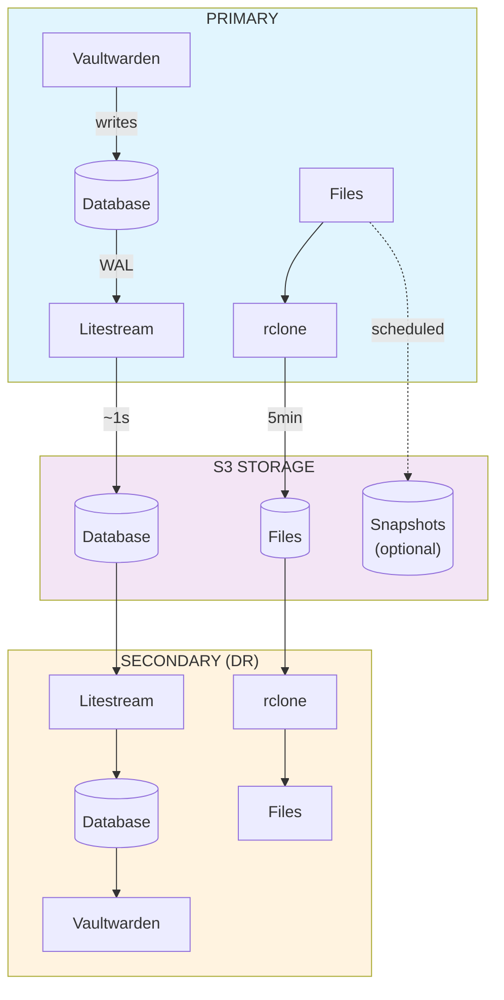

# Vaultwarden Stream

Vaultwarden with automated S3 backup — real-time database replication via [Litestream](https://litestream.io/) and file sync via [rclone](https://rclone.org/).

## Features

- **Real-time database replication** — Changes synced to S3 within ~1 second
- **Automatic file backup** — Attachments and keys synced every 5 minutes
- **Fully stateless** — All data in S3, restored on startup
- **Serverless ready** — Supports scale-to-zero deployments
- **Disaster recovery** — Run standby instances on different platforms
- **Optional snapshots** — Scheduled full backups for migration/compliance

## Quick Start

```bash
cp .env.example .env
# Edit .env: configure S3_BUCKET, S3_ENDPOINT, S3_ACCESS_KEY_ID, S3_SECRET_ACCESS_KEY

docker compose up -d
```

Access at `http://localhost:8080`

<details>
<summary><b>Cloudflare R2 Setup</b></summary>

1. Create R2 bucket: [Cloudflare Dashboard](https://dash.cloudflare.com/) → R2 → Create bucket
2. Generate API token: R2 → Manage R2 API Tokens → Create API Token
   - Permission: **Object Read & Write**
3. Copy Account ID from R2 overview page
4. Use Account ID in endpoint: `https://<ACCOUNT_ID>.r2.cloudflarestorage.com`

</details>

## Configuration

### Required

| Variable | Description |
|----------|-------------|
| `S3_PROVIDER` | S3 provider ([full list](https://rclone.org/s3/#s3-provider)) |
| `S3_BUCKET` | Bucket name |
| `S3_ENDPOINT` | S3 endpoint URL |
| `S3_ACCESS_KEY_ID` | Access key |
| `S3_SECRET_ACCESS_KEY` | Secret key |

### Common Options

| Variable | Default | Description |
|----------|---------|-------------|
| `NODE_ROLE` | `primary` | `primary` (main) or `secondary` (DR standby) |
| `DEPLOYMENT_MODE` | `persistent` | `persistent` (always-on) or `serverless` (scale-to-zero) |
| `PRIMARY_SYNC_INTERVAL` | `300` | File upload interval (seconds) |
| `BACKUP_ENABLED` | `false` | Enable scheduled full backups |
| `BACKUP_CRON` | `0 0 * * *` | Backup schedule ([cron expression](https://crontab.guru/)) |
| `LITESTREAM_SYNC_INTERVAL` | `1s` | Database replication interval |

See [.env.example](.env.example) for all options.

## Deployment Modes

Choose one based on your traffic pattern:

| Mode | Description | Best For |
|------|-------------|----------|
| `primary` + `persistent` | Always-on main instance | **Recommended for most users** |
| `primary` + `serverless` | Scales to zero when idle | Low-traffic deployments |
| `secondary` + `persistent` | Always-on DR standby | High availability |
| `secondary` + `serverless` | On-demand DR standby | Cost-optimized DR |

### Serverless Deployment

Requirements for scale-to-zero:

```yaml
# docker-compose.yml or platform config
max-instances: 1  # SQLite requires single writer
stop_grace_period: 120s  # Allow time for graceful shutdown
```

```bash
# .env
ENABLE_WEBSOCKET=false  # Allows scale-to-zero (clients use polling)
BACKUP_ENABLED=false  # Prevents scale-to-zero if enabled
```

**Graceful Shutdown:** Data is automatically flushed to S3 when stopping. Ensure `stop_grace_period` is sufficient:
- Default settings: `120s` minimum
- Large databases or slow S3: Increase `LITESTREAM_SHUTDOWN_TIMEOUT` and adjust `stop_grace_period` accordingly

## Architecture



**Data Sync:**
- **Database:** Continuous replication via Litestream (~1s latency)
- **Files:** Periodic sync via rclone (5min interval)
- **Snapshots:** Optional scheduled full backups (cron-based)

## Snapshot Backups

Create scheduled full backups (database + all files) independent of real-time replication:

```bash
BACKUP_ENABLED=true
BACKUP_CRON=0 0 * * *  # Daily at 0:00 AM (uses TZ)
BACKUP_RETENTION_DAYS=30  # Keep 30 days
BACKUP_MIN_KEEP=3  # Always keep at least 3 backups
```

Schedule uses [cron expressions](https://crontab.guru/) — supports daily, weekly, monthly, or custom intervals. Honors the `TZ` environment variable for timezone.

**Retention:** Deletes old backups while always keeping minimum count. Useful for migration or compliance.

### Multi-Destination Backup

Replicate backups to additional storage providers:

```bash
# Google Drive
RCLONE_CONFIG_GDRIVE_TYPE=drive
RCLONE_CONFIG_GDRIVE_TOKEN={"access_token":"...", "refresh_token":"..."}
BACKUP_EXTRA_REMOTES=GDRIVE:vaultwarden-backup

# SFTP
RCLONE_CONFIG_SFTP_TYPE=sftp
RCLONE_CONFIG_SFTP_HOST=backup.example.com
BACKUP_EXTRA_REMOTES=SFTP:/backups/vw

# Multiple destinations
BACKUP_EXTRA_REMOTES=GDRIVE:vw-backup, SFTP:/backups/vw
```

Generate OAuth tokens: `docker run --rm -it rclone/rclone config`
See [rclone docs](https://rclone.org/docs/#configure-remotes-with-environment-variables) for configuration.

### Restore from Snapshot

```bash
# Download and extract
rclone copy S3:bucket/vaultwarden/backups/vaultwarden-YYYYMMDD-HHMMSS.tar.gz /tmp/
tar -xzf /tmp/vaultwarden-*.tar.gz -C /data

# Start Vaultwarden (no special image needed)
docker run -d -v /data:/data -p 80:80 vaultwarden/server:latest
```

## Disaster Recovery

If primary becomes unavailable:

1. Point clients to secondary instance URL
2. Login sessions preserved (RSA keys synced to both)
3. Data freshness:
   - **Persistent:** Within 1 hour (configurable via `SECONDARY_SYNC_INTERVAL`)
   - **Serverless:** Latest S3 state on cold start

⚠️ **Never run two primary instances simultaneously** — SQLite supports only one writer.

## Data Safety

| Event | Data Loss |
|-------|-----------|
| Graceful shutdown | None |
| Crash (SIGKILL, power loss) | Up to 1 second (configurable via `LITESTREAM_SYNC_INTERVAL`) |

**Protection:**
- Set appropriate `stop_grace_period` for graceful shutdowns
- Enable S3 bucket versioning for accidental deletion protection
- Monitor logs for shutdown timeout warnings

## Troubleshooting

```bash
# View logs
docker logs vaultwarden

# Check sync status
docker exec vaultwarden cat /tmp/sync-status.json

# Verify S3 connectivity
docker exec vaultwarden rclone lsd S3:your-bucket

# Run health check
docker exec vaultwarden /app/healthcheck.sh
```

## Build from Source

```bash
docker build -t vaultwarden-stream .

# Multi-platform
docker buildx build --platform linux/amd64,linux/arm64 -t vaultwarden-stream .
```

## License

MIT — see [LICENSE](LICENSE).

Integrates [Vaultwarden](https://github.com/dani-garcia/vaultwarden) (AGPL-3.0), [Litestream](https://github.com/benbjohnson/litestream) (Apache 2.0), and [rclone](https://github.com/rclone/rclone) (MIT). See [THIRD-PARTY-LICENSES.md](THIRD-PARTY-LICENSES.md).
