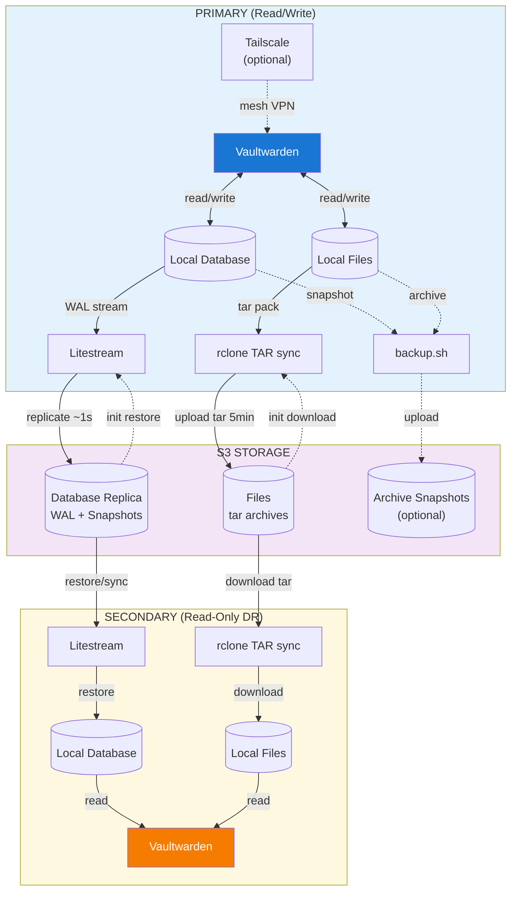

# Vaultwarden Stream

Vaultwarden with automated S3 backup — real-time database replication via [Litestream](https://litestream.io/), file sync via [rclone](https://rclone.org/), and optional private networking via [Tailscale](https://tailscale.com/).

## Features

- **Real-time database replication** — SQLite WAL streamed to S3 via Litestream (~1s latency)
- **Automatic file sync** — Attachments, sends, and RSA keys packed into tar archives and synced to S3 via rclone
- **Disaster recovery** — Run standby secondary instances that restore from S3
- **Scheduled backups** — Tar archives with retention and multi-destination support
- **Monitoring integration** — HTTP ping notifications for backup and sync events
- **Tailscale VPN** — Private mesh networking with Serve/Funnel; Headscale compatible

## Quick Start

```bash
cp .env.example .env
# Edit .env: set S3_PROVIDER, S3_BUCKET, S3_ENDPOINT, S3_ACCESS_KEY_ID, S3_SECRET_ACCESS_KEY

docker compose up -d
```

Access at `http://localhost`. See [.env.example](.env.example) for all configuration options and [environment.md](environment.md) for detailed documentation.

## Architecture



### Data Flow

**Primary instance**
- Vaultwarden reads/writes local database and files
- Litestream streams WAL to S3 (~1s latency)
- Files packed into tar archives and uploaded to S3 every 5 minutes (default)
- Optional: scheduled backups via cron
- On startup: restores from S3 if data exists

**Secondary instance (disaster recovery)**
- On startup: restores database and files from S3
- Vaultwarden runs in read-only mode
- Persistent mode: syncs from S3 every hour (default)
- Serverless mode: fetches latest state on each cold start

**S3 storage**
- Database: WAL stream + snapshots (managed by Litestream)
- Files: tar archives — `attachments.tar`, `sends.tar`, `config.tar`, `icon_cache.tar`
- Backups: optional encrypted tar archives

## Disaster Recovery

If primary fails, redirect clients to secondary. Login sessions are preserved.

**Secondary data freshness:**
- Persistent: within sync interval (default: 1 hour)
- Serverless: latest S3 state

> **Warning:** Never run two primary instances simultaneously — SQLite supports only one writer.

## Data Safety

| Event | Data Loss |
|-------|-----------|
| Graceful shutdown | None |
| Crash (SIGKILL) | Up to sync interval (default: 1s) |

Best practices:
- Set `stop_grace_period: 300s` in docker-compose.yml
- Enable S3 bucket versioning for deletion protection

## Troubleshooting

```bash
# View logs
docker logs vaultwarden

# Check sync status
docker exec vaultwarden cat /tmp/sync-status.json

# Verify S3 connectivity
docker exec vaultwarden rclone lsd S3:your-bucket

# Check Tailscale status (if enabled)
docker exec vaultwarden tailscale status

# Run health check
docker exec vaultwarden /app/healthcheck.sh
```

## Build from Source

```bash
docker build -t vaultwarden-stream .

# Multi-platform
docker buildx build --platform linux/amd64,linux/arm64 -t vaultwarden-stream .
```

## License

MIT — see [LICENSE](LICENSE).

Integrates [Vaultwarden](https://github.com/dani-garcia/vaultwarden) (AGPL-3.0), [Litestream](https://github.com/benbjohnson/litestream) (Apache 2.0), [rclone](https://github.com/rclone/rclone) (MIT), and [Tailscale](https://github.com/tailscale/tailscale) (BSD-3-Clause). See [THIRD-PARTY-LICENSES.md](THIRD-PARTY-LICENSES.md).
