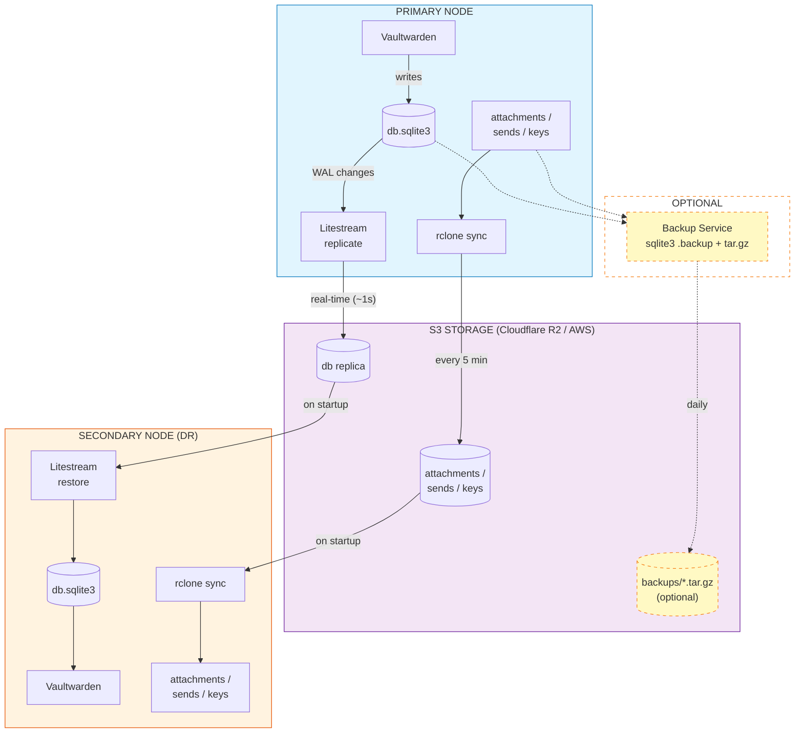

# Vaultwarden Stream

Vaultwarden with automated S3 backup — real-time database replication via [Litestream](https://litestream.io/) and file sync via [rclone](https://rclone.org/). Works with any S3-compatible storage.

## Features

- **Real-time database backup** — Litestream replicates SQLite WAL changes to S3 (~1 second delay)
- **File sync** — Attachments, sends, and RSA keys automatically synced to S3 (every 5 minutes)
- **Fully stateless** — All data stored in S3; freshly restored on every startup
- **Serverless ready** — Supports scale-to-zero on platforms like Cloud Run, Fly.io, etc.
- **Disaster recovery** — Run a secondary standby instance on a different platform
- **Snapshot backup** — Optional periodic tar.gz backups for migration, compliance, or extra safety

## Quick Start

```bash
cp .env.example .env
# Edit .env: fill in S3_BUCKET, S3_ENDPOINT, S3_ACCESS_KEY_ID, S3_SECRET_ACCESS_KEY

docker compose up -d
```

Access at `http://localhost:8080`

<details>
<summary><b>Cloudflare R2 Setup</b></summary>

1. Create R2 bucket: [Cloudflare Dashboard](https://dash.cloudflare.com/) → R2 → Create bucket
2. Generate API token: R2 → Manage R2 API Tokens → Create API Token
3. Note your Account ID (visible in R2 overview)

</details>

## Configuration

### Required

| Variable | Description |
|----------|-------------|
| `S3_PROVIDER` | S3 provider: `Cloudflare`, `AWS`, `Minio`, etc. ([full list](https://rclone.org/s3/#s3-provider)) |
| `S3_BUCKET` | Bucket name |
| `S3_ENDPOINT` | Endpoint URL |
| `S3_ACCESS_KEY_ID` | Access key |
| `S3_SECRET_ACCESS_KEY` | Secret key |

### Optional

| Variable | Default | Description |
|----------|---------|-------------|
| `NODE_ROLE` | `primary` | `primary` or `secondary` |
| `DEPLOYMENT_MODE` | `persistent` | `persistent` or `serverless` |
| `PRIMARY_SYNC_INTERVAL` | `300` | File upload interval (seconds) |
| `SECONDARY_SYNC_INTERVAL` | `3600` | Data refresh interval (seconds) |
| `BACKUP_ENABLED` | `false` | Enable periodic snapshot backup |
| `BACKUP_INTERVAL` | `86400` | Snapshot interval (seconds) |
| `BACKUP_RETENTION_DAYS` | `30` | Auto-delete snapshots older than N days |
| `BACKUP_MIN_KEEP` | `3` | Always keep at least N backups (includes recent ones) |
| `BACKUP_EXTRA_REMOTES` | _(empty)_ | Extra backup destinations (comma-separated, see below) |

All Vaultwarden and Litestream settings are also supported. See [.env.example](.env.example) for the complete list.

## Deployment Modes

| NODE_ROLE | DEPLOYMENT_MODE | Scale to Zero | Use Case |
|-----------|----------------|:------------:|----------|
| `primary` | `persistent` | ❌ | **Recommended.** Long-running production instance. |
| `primary` | `serverless` | ✅ | Low-traffic. Requires `max-instances=1`. |
| `secondary` | `persistent` | ❌ | DR standby with periodic refresh. |
| `secondary` | `serverless` | ✅ | DR standby, restores from S3 on cold start. |

### Serverless

For scale-to-zero deployments:

- Set `max-instances=1` — SQLite only supports one writer at a time
- Set `stop_grace_period: 30s` — gives enough time for graceful shutdown and final data upload
- Set `ENABLE_WEBSOCKET=false` — WebSocket connections keep the instance alive; disabling it allows scale-to-zero (clients will use 30-minute polling instead)
- Set `BACKUP_ENABLED=false` — periodic snapshot backups prevent scale-to-zero since they run continuously

All pending data is automatically flushed to S3 during graceful shutdown (SIGTERM), ensuring zero data loss.

## Architecture

```
+------------------------------------------------------+
|  PRIMARY NODE                                        |
+------------------------------------------------------+
|                                                      |
|  +-------------+               +------------------+  |
|  | Vaultwarden |-------------->| db.sqlite3       |  |
|  +-------------+               +--------+---------+  |
|                                         |            |
|                                    WAL writes        |
|                                         v            |
|                                +----------------+    |
|                                | Litestream     |    |
|                                +--------+-------+    |
|                                         |            |
|  +----------------------------+         |            |
|  | attachments / sends / keys |         |            |
|  +--------------+-------------+         |            |
|                 |                       |            |
|            rclone sync            real-time (~1s)    |
|            (every 5 min)                |            |
|                 |                       |            |
+-----------------|-----------------------|------------+
                  |                       |
                  v                       v
       +----------+-----------------------+----------+
       |               S3 STORAGE                    |
       |            (Cloudflare R2 / AWS)            |
       |                                             |
       |    /db.sqlite3        (WAL replica)         |
       |    /attachments/*     (file sync)           |
       |    /backups/*.tar.gz  (optional snapshots)  |
       |                                             |
       +----------+-----------------------+----------+
                  |                       |
                  v                       v
+-----------------|-----------------------|--------------+
|            rclone sync           Litestream restore    |
|                 |                       |              |
|                 v                       v              |
|  +----------------------------+  +------------------+  |
|  | attachments / sends / keys |  | db.sqlite3       |  |
|  +----------------------------+  +--------+---------+  |
|                                           |            |
|                                           v            |
|                                  +-------------+       |
|                                  | Vaultwarden |       |
|                                  +-------------+       |
|                                                        |
+--------------------------------------------------------+
|  SECONDARY NODE (Disaster Recovery)                    |
+--------------------------------------------------------+

..........................................................
:                                                        :
:  OPTIONAL: Backup Service (runs on PRIMARY)            :
:                                                        :
:  db + attachments + sends + keys                       :
:    --> sqlite3 .backup + tar.gz --> S3: /backups/      :
:                                                        :
:  Enable with BACKUP_ENABLED=true (default: daily)      :
:                                                        :
:........................................................:
```

### Data Flow

**Primary Node:**
1. Vaultwarden writes to db.sqlite3
2. Litestream captures WAL changes and replicates to S3 (real-time, ~1s delay)
3. rclone syncs attachments, sends, and RSA keys to S3 (every 5 minutes)

**Secondary Node:**
1. Litestream restores database from S3 on startup
2. rclone downloads files from S3
3. Vaultwarden serves as read-only DR standby

**Optional:**
- Backup service creates periodic tar.gz snapshots and uploads to S3 (`BACKUP_ENABLED=true`)

<details>
<summary><b>Alternative: Mermaid Diagram</b></summary>



- **Solid lines** — Core data flow (always active)
- **Dashed lines** — Optional backup flow (`BACKUP_ENABLED=true`)
- **Yellow / dashed border** — Optional components

</details>

### What Gets Backed Up

| Data | Method | Frequency |
|------|--------|-----------|
| Database | Litestream (WAL replication) | ~1 second |
| Attachments, sends, RSA keys, config | rclone (file sync) | 5 minutes |
| Snapshot (optional) | sqlite3 .backup + tar.gz | Daily |

## Snapshot Backup

Optional periodic tar.gz backups — independent of Litestream's real-time replication.

```bash
BACKUP_ENABLED=true
BACKUP_INTERVAL=86400        # Run backup every 24 hours
BACKUP_RETENTION_DAYS=30     # Delete backups older than 30 days
BACKUP_MIN_KEEP=3            # Always keep at least 3 total backups
```

Retention logic: backups older than `BACKUP_RETENTION_DAYS` are deleted, but at least `BACKUP_MIN_KEEP` total backups always remain. Recent backups (within retention period) count toward the minimum:

| Recent (≤30d) | Old (>30d) | min_keep=3 | Action |
|:---:|:---:|:---:|---|
| 5 | 20 | 5 ≥ 3 | Delete all 20 old |
| 1 | 20 | 1 < 3 | Keep 2 newest old, delete 18 |
| 0 | 20 | 0 < 3 | Keep 3 newest old, delete 17 |
| 0 | 2 | 0 < 3 | Keep all (only 2 exist) |

Snapshots are uploaded to `s3://<bucket>/<prefix>/backups/`. Each snapshot contains:
- Complete database (via SQLite backup API)
- All attachments and sends
- RSA keys and config.json

Useful for migration, compliance requirements, or as additional insurance beyond Litestream.

### Multi-Destination Backup

To protect against a single storage provider failure, you can replicate backups to additional remotes.

This uses rclone's native [environment variable configuration](https://rclone.org/docs/#configure-remotes-with-environment-variables) — set `RCLONE_CONFIG_<NAME>_<KEY>=value` to define remotes without a config file. rclone supports [70+ cloud providers](https://rclone.org/overview/).

**Example 1: Google Drive**

```bash
# 1. Generate OAuth token (run locally or in a temp container)
docker run --rm -it rclone/rclone config
# Follow prompts to authorize Google Drive, then copy the token from rclone.conf

# 2. Set environment variables
RCLONE_CONFIG_GDRIVE_TYPE=drive
RCLONE_CONFIG_GDRIVE_SCOPE=drive
RCLONE_CONFIG_GDRIVE_TOKEN={"access_token":"xxx","token_type":"Bearer","refresh_token":"xxx","expiry":"2026-01-01T00:00:00Z"}
BACKUP_EXTRA_REMOTES=GDRIVE:vaultwarden-backup
```

**Example 2: SFTP**

```bash
# Backup to a remote server via SFTP
RCLONE_CONFIG_BACKUP_SFTP_TYPE=sftp
RCLONE_CONFIG_BACKUP_SFTP_HOST=backup.example.com
RCLONE_CONFIG_BACKUP_SFTP_USER=backupuser
RCLONE_CONFIG_BACKUP_SFTP_PASS=obscured-password  # Generate: echo "pass" | rclone obscure -
RCLONE_CONFIG_BACKUP_SFTP_PORT=22
BACKUP_EXTRA_REMOTES=BACKUP_SFTP:/backups/vaultwarden
```

Multiple destinations:

```bash
BACKUP_EXTRA_REMOTES=GDRIVE:vw-backup, BACKUP_SFTP:/backups/vw
```

- Primary S3 upload must succeed; extra remotes are best-effort (failures logged as warnings)
- Retention policy (`BACKUP_RETENTION_DAYS` / `BACKUP_MIN_KEEP`) applies independently to each destination
- See [.env.example](.env.example) for a complete configuration example

### Restore from Snapshot

```bash
# Download and extract to /data
rclone copy S3:bucket/vaultwarden/backups/vaultwarden-20260208-120000.tar.gz /tmp/
mkdir -p /data && tar -xzf /tmp/vaultwarden-*.tar.gz -C /data

# Start with any Vaultwarden image (no Litestream needed)
docker run -d -v /data:/data -p 80:80 vaultwarden/server:latest
```

## Disaster Recovery

If the primary instance becomes unavailable:

1. Point your clients to the secondary instance URL
2. Login sessions are preserved (RSA keys are synced to both instances)
3. Data freshness:
   - Persistent mode: within `SECONDARY_SYNC_INTERVAL` (default 1 hour)
   - Serverless mode: restored from latest S3 state on cold start

> **Warning:** Never run two primary instances at the same time — SQLite only supports one writer.

## Data Safety

| Scenario | Maximum Data Loss |
|----------|------------------|
| Graceful shutdown (scale-to-zero, restart) | None |
| Catastrophic crash (SIGKILL, power loss) | Up to ~1 second of recent database changes |

**Additional Protection:**
- Enable S3 bucket versioning to protect against accidental deletion or corruption
- Configure S3 lifecycle rules to automatically expire old versions after a retention period

## Troubleshooting

```bash
docker logs vaultwarden
docker exec vaultwarden cat /tmp/sync-status.json
docker exec vaultwarden rclone lsd S3:your-bucket
docker exec vaultwarden /app/healthcheck.sh
```

## Build from Source

```bash
docker build -t vaultwarden-stream .

# Multi-platform
docker buildx build --platform linux/amd64,linux/arm64 -t vaultwarden-stream .
```

## License

MIT — see [LICENSE](LICENSE).

This image integrates [Vaultwarden](https://github.com/dani-garcia/vaultwarden) (AGPL-3.0), [Litestream](https://github.com/benbjohnson/litestream) (Apache 2.0), and [rclone](https://github.com/rclone/rclone) (MIT). See [THIRD-PARTY-LICENSES.md](THIRD-PARTY-LICENSES.md).
