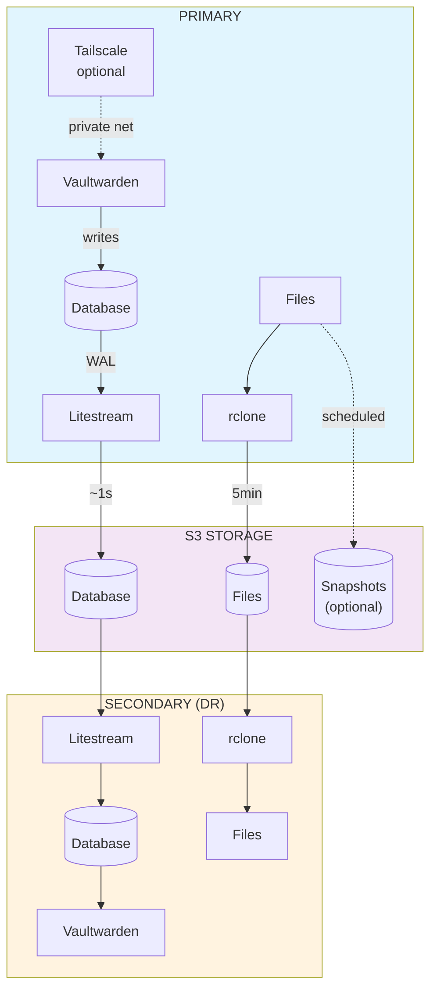

# Vaultwarden Stream

Vaultwarden with automated S3 backup — real-time database replication via [Litestream](https://litestream.io/), file sync via [rclone](https://rclone.org/), and optional private networking via [Tailscale](https://tailscale.com/).

## Features

- **Real-time database replication** — SQLite WAL streamed to S3 via Litestream (~1s latency)
- **Automatic file sync** — Attachments, sends, and RSA keys synced to S3 via rclone
- **Disaster recovery** — Run standby secondary instances that restore from S3
- **Snapshot backup** — Scheduled archives with retention and multi-destination support
- **Monitoring integration** — HTTP ping notifications for backup and sync events
- **Tailscale VPN** — Private mesh networking with Serve/Funnel; Headscale compatible

## Quick Start

```bash
cp .env.example .env
# Edit .env: set S3_BUCKET, S3_ENDPOINT, S3_ACCESS_KEY_ID, S3_SECRET_ACCESS_KEY

docker compose up -d
```

Access at `http://localhost:8080`. See [.env.example](.env.example) for all configuration options.

## Configuration

All configuration is via environment variables. See [.env.example](.env.example) for inline documentation.

### S3 Storage

Used by Litestream (database replication) and rclone (file sync). All fields are required unless noted.

| Variable | Default | Description |
|----------|---------|-------------|
| `S3_PROVIDER` | `Cloudflare` | S3 provider ([rclone list](https://rclone.org/s3/#s3-provider)) |
| `S3_BUCKET` | — | Bucket name |
| `S3_ENDPOINT` | — | S3 endpoint URL |
| `S3_ACCESS_KEY_ID` | — | Access key |
| `S3_SECRET_ACCESS_KEY` | — | Secret key |
| `S3_PREFIX` | `vaultwarden` | Path prefix inside the bucket |
| `S3_REGION` | `auto` | S3 region |
| `S3_ACL` | `private` | Object ACL |
| `S3_NO_CHECK_BUCKET` | `true` | Skip bucket existence check |

### Deployment

| Variable | Default | Description |
|----------|---------|-------------|
| `NODE_ROLE` | `primary` | `primary` (read/write) or `secondary` (read-only DR) |
| `DEPLOYMENT_MODE` | `persistent` | `persistent` (always-on) or `serverless` (scale-to-zero) |
| `PRIMARY_SYNC_INTERVAL` | `300` | File upload interval in seconds (primary only) |
| `SECONDARY_SYNC_INTERVAL` | `3600` | Data refresh interval in seconds (secondary only) |
| `RCLONE_REMOTE_NAME` | `S3` | rclone remote name |
| `HEALTHCHECK_MAX_SYNC_AGE` | `600` | Max seconds since last sync before unhealthy |

### Litestream (Database Replication)

| Variable | Default | Description |
|----------|---------|-------------|
| `LITESTREAM_SYNC_INTERVAL` | `1s` | WAL replication interval (data loss window) |
| `LITESTREAM_SNAPSHOT_INTERVAL` | `30m` | Full snapshot creation interval |
| `LITESTREAM_RETENTION` | `24h` | Snapshot/WAL retention period |
| `LITESTREAM_VALIDATION_INTERVAL` | — | Automatic replica validation interval (restores and verifies S3 data)<br>⚠️ **Currently non-functional in v0.5.x**. Leave empty. |
| `LITESTREAM_DB_PATH` | `/data/db.sqlite3` | Local database file path |
| `LITESTREAM_REPLICA_PATH` | `<S3_PREFIX>/db.sqlite3` | S3 replica path (auto-derived) |
| `LITESTREAM_SHUTDOWN_TIMEOUT` | `30` | Seconds to flush WAL before forced shutdown |
| `LITESTREAM_FORCE_PATH_STYLE` | `false` | Path-style S3 URLs (required for MinIO, Ceph) |
| `LITESTREAM_SKIP_VERIFY` | `false` | Skip TLS certificate verification |

### Backup (Optional)

| Variable | Default | Description |
|----------|---------|-------------|
| `BACKUP_ENABLED` | `false` | Enable scheduled backups |
| `BACKUP_CRON` | `0 0 * * *` | Cron schedule ([editor](https://crontab.guru/)) |
| `BACKUP_FORMAT` | `tar.gz` | `tar.gz` (compressed, supports encryption) or `tar` (uncompressed, faster) |
| `BACKUP_PASSWORD` | — | Encryption password (requires `tar.gz` format) |
| `BACKUP_REMOTES` | — | Remote destinations, comma-separated |
| `BACKUP_RETENTION_DAYS` | `30` | Delete backups older than N days |
| `BACKUP_MIN_KEEP` | `3` | Always keep at least N recent backups |
| `BACKUP_INCLUDE_ATTACHMENTS` | `true` | Include attachments |
| `BACKUP_INCLUDE_SENDS` | `true` | Include sends |
| `BACKUP_INCLUDE_CONFIG` | `true` | Include RSA keys and config.json |
| `BACKUP_INCLUDE_ICON_CACHE` | `false` | Include icon cache (icons can be re-fetched, but backup speeds up recovery) |
| `BACKUP_ON_STARTUP` | `false` | Run backup immediately on startup (in addition to scheduled backups) |
| `BACKUP_SHUTDOWN_TIMEOUT` | `60` | Seconds to wait for in-progress backup |

### Notifications (Optional)

| Variable | Default | Description |
|----------|---------|-------------|
| `NOTIFICATION_URL` | — | HTTP ping URL for monitoring events<br>Compatible with [Healthchecks.io](https://healthchecks.io/), [Cronitor](https://cronitor.io/), [UptimeRobot](https://uptimerobot.com/), etc. |
| `NOTIFICATION_EVENTS` | — | Events to notify (comma-separated):<br>`backup_success`, `backup_failure`, `sync_error`<br>Leave empty to notify on all events |
| `NOTIFICATION_TIMEOUT` | `10` | curl timeout in seconds for notification requests |

### Advanced

| Variable | Default | Description |
|----------|---------|-------------|
| `RCLONE_FLAGS` | — | Additional rclone flags for all operations<br>Example: `--transfers 16 --checkers 32`<br>Use with caution |

### Tailscale (Optional)

| Variable | Default | Description |
|----------|---------|-------------|
| `TAILSCALE_ENABLED` | `false` | Enable Tailscale mesh VPN |
| `TAILSCALE_AUTHKEY` | — | Auth key for node registration |
| `TAILSCALE_HOSTNAME` | `vaultwarden` | Node hostname on the tailnet |
| `TAILSCALE_STATE_DIR` | `/var/lib/tailscale` | Persistent state directory |
| `TAILSCALE_LOGIN_SERVER` | — | Custom control server URL (for [Headscale](https://github.com/juanfont/headscale)) |
| `TAILSCALE_SERVE_PORT` | — | Local port to expose via Serve (blank = disabled) |
| `TAILSCALE_SERVE_MODE` | `https` | Serve protocol (`https`, `tls-terminated-tcp`) |
| `TAILSCALE_FUNNEL` | `false` | Expose to the **public internet** via Tailscale Funnel |
| `TAILSCALE_EXTRA_ARGS` | — | Additional `tailscale up` flags |

## Deployment Modes

| Mode | Description | Best For |
|------|-------------|----------|
| `primary` + `persistent` | Always-on main instance | **Recommended for most users** |
| `primary` + `serverless` | Scales to zero when idle | Low-traffic deployments |
| `secondary` + `persistent` | Always-on read-only DR standby | High availability |
| `secondary` + `serverless` | On-demand read-only DR standby | Cost-optimized DR |

### Serverless

For scale-to-zero platforms, set `DEPLOYMENT_MODE=serverless`. Requirements:
- `max-instances: 1` (SQLite requires single writer)
- `stop_grace_period: 120s`
- `ENABLE_WEBSOCKET=false` (allows scale-to-zero)
- `BACKUP_ENABLED=false` (cron prevents scale-to-zero)

## Architecture



**Data Sync:**
- **Database:** Continuous WAL replication via Litestream (~1s latency)
- **Files:** Periodic sync via rclone (configurable interval, default 5min)
- **Snapshots:** Optional scheduled full backups (cron-based)

## Tailscale

Embedded Tailscale uses userspace networking — no `NET_ADMIN` or `/dev/net/tun` required.

```bash
# Basic — private tailnet access
TAILSCALE_ENABLED=true
TAILSCALE_AUTHKEY=tskey-auth-xxxxx

# HTTPS via Serve (auto TLS)
TAILSCALE_SERVE_PORT=80
# → https://vaultwarden.<tailnet>.ts.net

# Public via Funnel (requires ACL policy)
TAILSCALE_FUNNEL=true

# Self-hosted with Headscale
TAILSCALE_LOGIN_SERVER=https://headscale.example.com
```

Mount a volume at `TAILSCALE_STATE_DIR` to persist state across restarts.

## Snapshot Backups

Scheduled archives (database + attachments + config), independent of real-time replication. Archives reduce R2 operation costs vs uploading individual files.

```bash
BACKUP_ENABLED=true
BACKUP_CRON=0 0 * * *
BACKUP_RETENTION_DAYS=30
BACKUP_REMOTES=S3:my-bucket/vw-backups

# Optional
BACKUP_PASSWORD=secret        # Encryption
BACKUP_FORMAT=tar             # Uncompressed (faster)
```

### Multi-Destination

Replicate to additional remotes ([rclone docs](https://rclone.org/docs/#configure-remotes-with-environment-variables)):

```bash
RCLONE_CONFIG_GDRIVE_TYPE=drive
RCLONE_CONFIG_GDRIVE_TOKEN={"access_token":"...", "refresh_token":"..."}
BACKUP_REMOTES=S3:my-bucket/vw-backups, GDRIVE:vw-backup
```

### Backup on Startup

Run an immediate backup when the container starts (useful for testing or ensuring fresh deployments are backed up):

```bash
BACKUP_ENABLED=true
BACKUP_ON_STARTUP=true
BACKUP_REMOTES=S3:my-bucket/vw-backups
```

### Notifications

Monitor backup and sync operations with HTTP ping notifications. Compatible with **Healthchecks.io**, **Cronitor**, **UptimeRobot**, and custom webhook services.

```bash
# Healthchecks.io example
NOTIFICATION_URL=https://hc-ping.com/your-uuid-here
NOTIFICATION_EVENTS=backup_success,backup_failure,sync_error
```

**Notification endpoints:**
- **Success**: `GET $NOTIFICATION_URL` (backup_success)
- **Failure**: `GET $NOTIFICATION_URL/fail` (backup_failure, sync_error)

**Supported events:**
- `backup_success` — Scheduled backup completed successfully
- `backup_failure` — Scheduled backup failed
- `sync_error` — File sync operation failed (primary upload or secondary download)

### Advanced rclone Configuration

Tune rclone performance for large vaults:

```bash
RCLONE_FLAGS=--transfers 16 --checkers 32 --buffer-size 32M
```

See [rclone docs](https://rclone.org/docs/) for all available flags.

### Restore from Snapshot

```bash
# tar.gz (compressed)
tar -xzf vaultwarden-*.tar.gz -C /data

# tar (uncompressed)
tar -xf vaultwarden-*.tar -C /data

# Encrypted (will prompt for password)
openssl enc -d -aes-256-cbc -pbkdf2 -in vaultwarden-*.tar.gz.enc | tar -xz -C /data
```

## Disaster Recovery

If primary is unavailable, point clients to the secondary instance. Login sessions are preserved (RSA keys synced).

Data freshness on secondary:
- **Persistent:** Within `SECONDARY_SYNC_INTERVAL` (default: 1 hour)
- **Serverless:** Latest S3 state at cold start

> **Never run two primary instances simultaneously** — SQLite supports only one writer.

## Data Safety

| Event | Data Loss |
|-------|-----------|
| Graceful shutdown | None |
| Crash (SIGKILL) | Up to `LITESTREAM_SYNC_INTERVAL` (default: 1s) |

Set `stop_grace_period ≥ 120s` and enable S3 bucket versioning for accidental deletion protection.

## Troubleshooting

```bash
# View logs
docker logs vaultwarden

# Check sync status
docker exec vaultwarden cat /tmp/sync-status.json

# Verify S3 connectivity
docker exec vaultwarden rclone lsd S3:your-bucket

# Check Tailscale status (if enabled)
docker exec vaultwarden tailscale status

# Run health check
docker exec vaultwarden /app/healthcheck.sh
```

## Build from Source

```bash
docker build -t vaultwarden-stream .

# Multi-platform
docker buildx build --platform linux/amd64,linux/arm64 -t vaultwarden-stream .
```

## License

MIT — see [LICENSE](LICENSE).

Integrates [Vaultwarden](https://github.com/dani-garcia/vaultwarden) (AGPL-3.0), [Litestream](https://github.com/benbjohnson/litestream) (Apache 2.0), [rclone](https://github.com/rclone/rclone) (MIT), and [Tailscale](https://github.com/tailscale/tailscale) (BSD-3-Clause). See [THIRD-PARTY-LICENSES.md](THIRD-PARTY-LICENSES.md).
