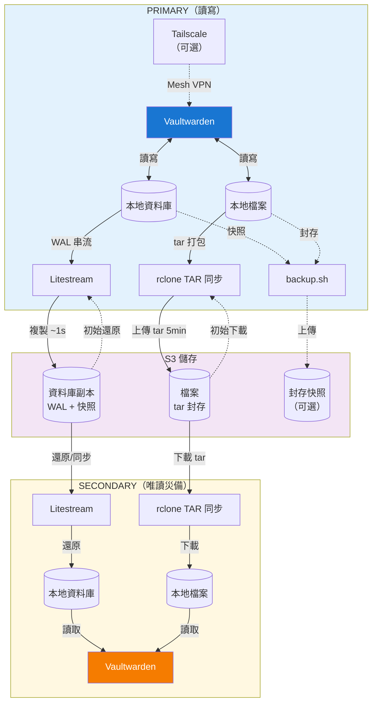

# Vaultwarden Stream

[English](README.md)

[Vaultwarden](https://github.com/dani-garcia/vaultwarden) 搭配自動化 S3 備份 — 透過 [Litestream](https://litestream.io/) 即時資料庫複製、透過 [rclone](https://rclone.org/) 檔案同步，以及可選的 [Tailscale](https://tailscale.com/) 私有網路。

## 功能

- **即時資料庫複製** — SQLite WAL 透過 Litestream 串流至 S3（延遲約 1 秒）
- **自動檔案同步** — 附件、Send、RSA 金鑰打包為 tar 封存，經 rclone 同步至 S3
- **災難復原** — 部署唯讀備援 Secondary 實例，從 S3 還原
- **排程備份** — Tar 封存，支援保留天數與多目的地
- **監控整合** — HTTP ping 通知備份與同步事件
- **Tailscale VPN** — 私有 Mesh 網路，支援 Serve / Funnel，相容 Headscale

## 快速開始

```bash
cp .env.example .env
# 編輯 .env：設定 S3_PROVIDER、S3_BUCKET、S3_ENDPOINT、S3_ACCESS_KEY_ID、S3_SECRET_ACCESS_KEY

docker compose up -d
```

存取 `http://localhost`。完整設定選項請參閱 [.env.example](.env.example)，詳細說明請參閱 [environment.md](environment.md)。

## 架構



### 資料流向

**Primary 實例**
- Vaultwarden 讀寫本地資料庫與檔案
- Litestream 將 WAL 串流至 S3（延遲約 1 秒）
- 檔案打包為 tar 封存，每 5 分鐘上傳至 S3（預設）
- 可選：透過 cron 排程備份
- 啟動時：僅在本地資料庫不存在時從 S3 還原

**Secondary 實例（災難復原）**
- 啟動時：從 S3 還原資料庫與檔案
- Vaultwarden 以唯讀模式運行
- Persistent 模式：每小時從 S3 同步（預設）
- Serverless 模式：每次冷啟動擷取最新狀態

**S3 儲存**
- 資料庫：WAL 串流 + 快照（由 Litestream 管理）
- 檔案：tar 封存 — `attachments.tar`、`sends.tar`、`config.tar`、`icon_cache.tar`
- 備份：可選的加密 tar 封存

## 災難復原

Primary 故障時，將用戶端導向 Secondary。登入 Session 會被保留。

**Secondary 資料新鮮度：**
- Persistent：在同步間隔內（預設：1 小時）
- Serverless：S3 上的最新狀態

> **警告：** 切勿同時執行兩個 Primary 實例 — SQLite 僅支援單一寫入者。

## 資料安全

| 事件 | 資料遺失 |
|------|----------|
| 正常關機 | 無 |
| 異常終止（SIGKILL） | 最多至同步間隔（預設：1 秒） |

最佳實踐：
- 在 docker-compose.yml 中設定 `stop_grace_period: 300s`
- 啟用 S3 bucket 版本控制以防誤刪

## 疑難排解

```bash
# 檢視日誌
docker logs vaultwarden

# 檢查同步狀態
docker exec vaultwarden cat /tmp/sync-status.json

# 驗證 S3 連線
docker exec vaultwarden rclone lsd S3:your-bucket

# 檢查 Tailscale 狀態（啟用時）
docker exec vaultwarden tailscale status

# 執行健康檢查
docker exec vaultwarden /app/healthcheck.sh
```

### 從備份還原

```bash
# 壓縮格式（tar.gz）
tar -xzf vaultwarden-20260211-120000.tar.gz -C /data

# 未壓縮格式（tar）
tar -xf vaultwarden-20260211-120000.tar -C /data

# 加密格式（tar.gz.enc）— 解密後解壓，會提示輸入 BACKUP_PASSWORD
openssl enc -d -aes-256-cbc -pbkdf2 -in vaultwarden-20260211-120000.tar.gz.enc | tar -xz -C /data
```

## 從原始碼建置

```bash
docker build -t vaultwarden-stream .

# 多平台
docker buildx build --platform linux/amd64,linux/arm64 -t vaultwarden-stream .
```

## 授權

MIT — 見 [LICENSE](LICENSE)。

整合 [Vaultwarden](https://github.com/dani-garcia/vaultwarden)（AGPL-3.0）、[Litestream](https://github.com/benbjohnson/litestream)（Apache 2.0）、[rclone](https://github.com/rclone/rclone)（MIT）與 [Tailscale](https://github.com/tailscale/tailscale)（BSD-3-Clause）。詳見 [THIRD-PARTY-LICENSES.md](THIRD-PARTY-LICENSES.md)。
